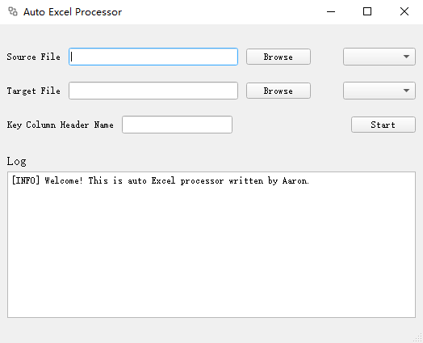
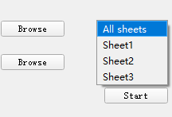

# Excel Auto Processor 

## What is This Program Used For

Assume there are two excel sheets: sheet A and sheet B. Both of them have a header called 'Name'.

This is sheet A.

| Name   | Gender | Job               | Phone        |
| ------ | ------ | ----------------- | ------------ |
| Aaron  | male   | software engineer | 133-68157820 |
| Wilson | male   | teacher           | 186-81199679 |
| Smith  | female | nurse             | 152-10350939 |
| John   | male   | doctor            | 153-96524678 |

And this is sheet B. As you can see below, sheet B is not intact. It misses information of there person.

| Name  | Job    | Phone        |
| :---- | :----- | :----------- |
| Aaron |        |              |
| John  |        | 153-96524678 |
| Fred  | lawyer |              |

**Excel Auto Processor** can be used to complement sheet B using sheet A.

Open the program, you can see the user interface like this. 



1. First, select sheet A as source file, and select sheet B as target file. 
2. Type in key column header name. In this case, we type in 'Name'.
3. Click **Start** button, then program will generate complemented sheet B in the same directory as sheet B. All the runtime log information will be printed in text box at bottom.

Besides, if there are multiple sheets in one excel file, you can decide which sheet to manipulate, or can select **All sheets** option.



Now, sheet B is intact. (Notice that we still don't know Fred's phone number, because Fred's information doesn't exist in sheet A)

| Name  | Job               | Phone        |
| ----- | ----------------- | ------------ |
| Aaron | software engineer | 133-68157820 |
| John  | doctor            | 153-96524678 |
| Fred  | lawyer            |              |


## How to Run in Python Environment

Make sure python 3 and following python packages are installed. (`xlwt` is used to output `.xls`file, now is deprecated)
``` shell
$> pip install pandas
$> pip install pyqt5
$> pip install xlrd
$> pip install xlwt
$> pip install openpyxl
```
Run `view.py` file.
``` shell
$> py src/view.py
```


## How to Use

After open the user interface, select source file and target file. Type in key column header name, then hit the **`Start`** button. The program would generate `.auto.xlsx` file in the same directory as target file.  
All the program runtime information will be presented in the text box at bottom.


## How to Build Distribution
This section is about how to generate executable file from our python files. 

If we want to narrow the generated `.exe` file size, building process must be done in virtual environment. Otherwise, `pyinstaller` will include other uncorrelated packages in building process.
First, install python virtual environment tool `pipenv`.

``` shell
$> pip install pipenv
```

Then, enter python virtual environment.

``` shell
$> pipenv shellpyu
```

Check if you have entered virtual environment successfully. You can see there are only three packages installed in virtual environment.

``` shell
$> pip list
Package    Version
---------- -------
pip        21.1.1
setuptools 56.0.0
wheel      0.36.2
```

Use `pip` to install essential packages listed in [How to Run in Python Environment](# How to Run in Python Environment) section.
Run `setup.py`.  

``` shell
$> py setup.py
```
After processing, `view.exe` would be generated in `dist` folder.  
At last, quit virtual environment.

``` shell
$> exit
```


## Other
**Qt Designer** is a helpful tool to build GUI visually.  
All the `.ui` files are palced in `ui` folder. You can open them with **Qt Designer**.
The `.ui` file can be exported from Qt Designer.  
Use following command to convert a `.ui` file into `.py` file.
``` shell
$> pyuic5 -x ui/<filename>.ui -o <filename>.py
```